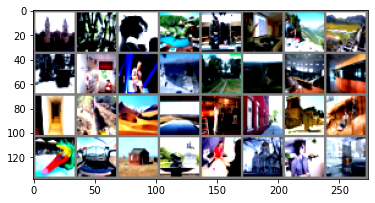

# MiniPlaces
 
[Miniplaces](https://github.com/CSAILVision/miniplaces) is a scene recognition dataset developed by MIT. This dataset has 120K images from 100 scene categories. The categories are mutually exclusive. The dataset is split into 100K images for training, 10K images for validation, and 10K for testing.

The original image resolution for images in MiniPlaces is 128x128. To make the training feasible, the data loader reduces the image resolution to 32x32. dataloader.py will also download the full dataset the first time you run train_miniplaces.py.

predict.py asks the trained model to predict the following images:

These were the labels predicted by the model starting from top left:

palace  
bamboo_forest 
beauty_salon 
swimming_pool/outdoor 
lobby 
office  
canyon  
railroad_track   
shed  
kitchen  
stage/indoor  
ski_slope  
chalet  
valley  
auditorium  
lobby  
corridor  
trench  
valley  
desert/sand  
martial_arts_gym  
fire_station  
palace  
hot_spring  
swimming_pool/outdoor  
cockpit   
shed  
fountain  
beauty_salon  
monastery/outdoor  
laundromat  
phone_booth 
